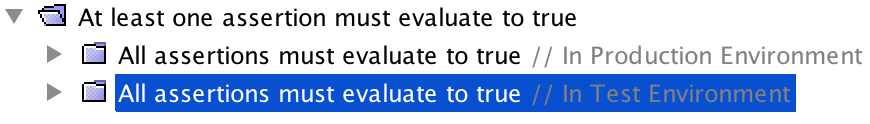
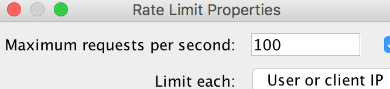
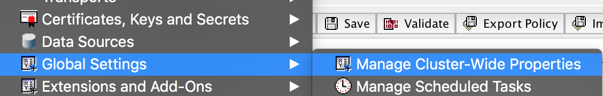
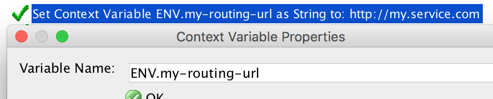
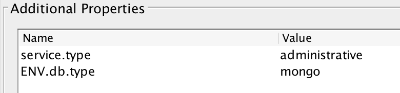
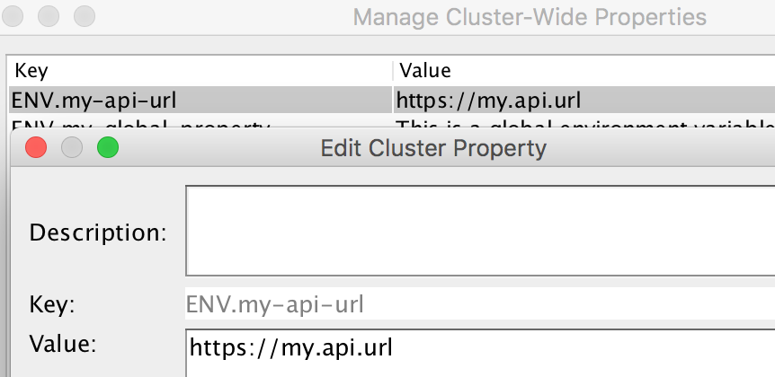
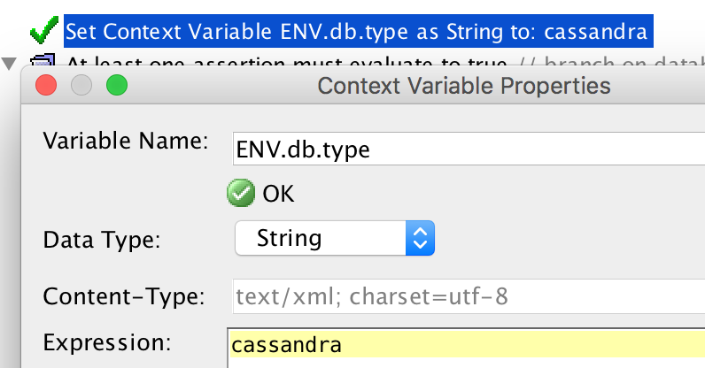
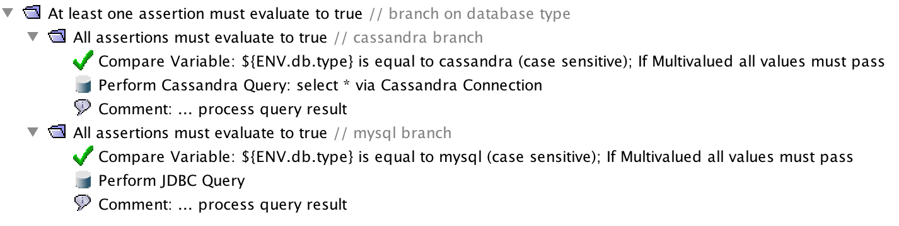
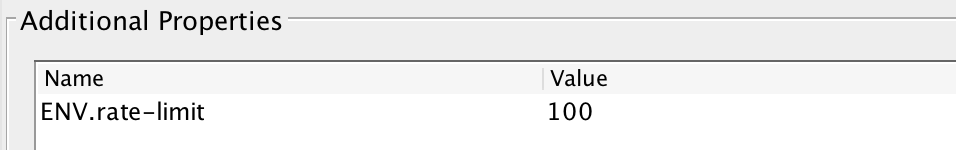
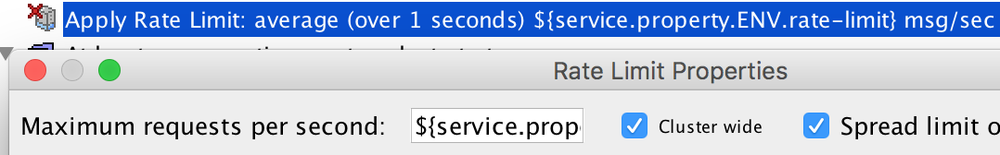

# Environment Properties Configuration
This is a standard java properties file that contains the different environment properties to configure on the Gateway. 
The environment properties configuration file is expected to be in the `config` directory. It should be called `env.properties`.

An example `env.properties` file might look like:
```properties
  my-env-property=This is a properties value
  another-property=\
    {"another":"properties",\
     "value":"0"\
    }
```

## Using Environment Properties
Writing Policy for Gateway is easy (once you get the hang of ot), however writing policy that is easy to deploy into different environments can be tricky. This section talks about how to use and reference environment variables within policy so that your policy is simple to deploy to multiple environments.

### Places Environment is Referenced
The Gateway can require many different types of environment configurations. For example:
* JDBC connection information
* Secure Passwords
* Trusted Certificates
* Private Keys
* ...

Here we will focus solely on environment properties that are referenced within policy.

Some examples of this include:
* Routing URLs
  * ```xml
    <L7p:HttpRoutingAssertion>
        <L7p:ProtectedServiceUrl stringValue="https://my.service.com"/>
        ...
    ```
     Assertion Properties")
* Branching Hints (if prod do ...)
  * ```xml
    <wsp:OneOrMore wsp:Usage="Required">
        <wsp:All wsp:Usage="Required">
            <L7p:ComparisonAssertion>
                <L7p:Expression1 stringValue="${environmentType}"/>
                <L7p:Expression2 stringValue="production"/>
                <L7p:Predicates predicates="included">
                    <L7p:item binary="included">
                        <L7p:RightValue stringValue="production"/>
                    </L7p:item>
                </L7p:Predicates>
            </L7p:ComparisonAssertion>
            ...
        </wsp:All>
        <wsp:All wsp:Usage="Required">
            <L7p:ComparisonAssertion>
                <L7p:Expression1 stringValue="${environmentType}"/>
                <L7p:Expression2 stringValue="test"/>
                <L7p:Predicates predicates="included">
                    <L7p:item binary="included">
                        <L7p:RightValue stringValue="test"/>
                    </L7p:item>
                </L7p:Predicates>
            </L7p:ComparisonAssertion>
            ...
        </wsp:All>
    </wsp:OneOrMore>
    ```
    
* Assertion configuration
  * ```xml
    <L7p:RateLimit>
        <L7p:CounterName stringValue="PRESET(acbdaf65450dd440)${request.clientid}"/>
        <L7p:MaxRequestsPerSecond stringValue="100"/>
    </L7p:RateLimit>
    ```
    

### Moving Environment to Variables
The first step would be to use variables to reference environment information instead of hard coding it in. There are a few options for variables to use: Cluster Properties, Context Variables or Service Properties. No matter what option you use to refer to environment variables it is important to use a consistent naming convention.

> Environment variables names ***must*** begin with **`ENV`**.

Doing so allows you to visible and simply distinguish what is an environment variable. It also makes it simpler for tools to find, expose, and apply environment values to the variables.

Here are some more details on the different ways to define environment variables.

#### Cluster Properties
Cluster properties are properties that are available to all policies in your environment.  When referring to them you must use the `gateway` prefix: ```${gateway.ENV.my-global-property}```


#### Context Variables
Context Variables can be set at any point within a policy by using the `Set Context Variable Assertion`. They are usable only within policy after the line that they are declared on.
```xml
<L7p:SetVariable>
    <L7p:VariableToSet stringValue="ENV.my-routing-url"/>
</L7p:SetVariable>
```


#### Service Properties
Service properties are configured on a service itself. These are available within the policy for this service. When referring to them you must use the `service.property` prefix.
```yaml
  solution/my-service.xml:
    httpMethods:
    - GET
    url: "/my-service"
    properties:
      ENV.db.type:
```


### Using Environment Variables in Policy
Using examples, lets see how you can use the different methods to provide environment variables to policy

#### Using Cluster Properties to Provide a Routing URL
The `Route via HTTP(S) Assertion` requires a routing url in order to know where to route to. You can use a Cluster Property to provide this routing URL.
1. Create a Cluster Property for the API to route to. Make sure to use the ENV prefix for the property name.
   * In `env.properties`:
     ```properties
        my-api-url=http://my.api-url
     ```
     
2. In your `Route via HTTP(S) Assertion` you can refer to the cluster property in the URL . Make sure to use the `gateway.ENV` prefix in order to refer to a cluster property that is also an environment variable.
   * ```xml
     <L7p:HttpRoutingAssertion>
         <L7p:ProtectedServiceUrl stringValue="${gateway.ENV.my-api-url}"/>
         ...
     ```
      Assertion Properties Using ENV")


#### Use Context Variables to Provide Branching Hints Based on Environment
Sometimes a different environment will requires slightly different policy. For example, one environment may use a Cassandra database while another might use a MySQL database. You could use an environment property provided via a context variable in order to branch.
1. Add the `Set Context Variable Assertion` to specify the database type. Make sure to use the ENV prefix for the variable name.
   * ```xml
     <L7p:SetVariable>
         <L7p:VariableToSet stringValue="ENV.db.type"/>
     </L7p:SetVariable>
     ```
     
2. Add the branching logic, checking the context variable value.
   * ```xml
     <wsp:OneOrMore wsp:Usage="Required">
         <wsp:All wsp:Usage="Required">
             <L7p:ComparisonAssertion>
                 <L7p:Expression1 stringValue="${ENV.db.type}"/>
                 <L7p:Expression2 stringValue="cassandra"/>
                 <L7p:Predicates predicates="included">
                     <L7p:item binary="included">
                         <L7p:RightValue stringValue="cassandra"/>
                     </L7p:item>
                 </L7p:Predicates>
             </L7p:ComparisonAssertion>
             ...
         </wsp:All>
         <wsp:All wsp:Usage="Required">
             <L7p:ComparisonAssertion>
                 <L7p:Expression1 stringValue="${ENV.db.type}"/>
                 <L7p:Expression2 stringValue="mysql"/>
                 <L7p:Predicates predicates="included">
                     <L7p:item binary="included">
                         <L7p:RightValue stringValue="mysql"/>
                     </L7p:item>
                 </L7p:Predicates>
             </L7p:ComparisonAssertion>
             ...
         </wsp:All>
     </wsp:OneOrMore>
     ```
     

#### Use a Service Property to Provide Configuration for the Rate Limit Assertion
In order to protect a backend or monetize an API you will need to apply a rate limit. This rate limit will likely be different depending on the environment. You can use a service property to provide the rate limit value.
1. Create a service property for the rate limit. Make sure to use the ENV prefix for the variable name.
   * ```yaml
       solution/my-service.xml:
         httpMethods:
         - GET
         url: "/my-service"
         properties:
           ENV.rate-limit:
     ```
      
2. Reference the Service Property in the `Apply Rate Limit Assertion`. Make sure to use the `service.property.ENV` prefix in order to refer to a service property that is also an environment variable.
   * ```xml
     <L7p:RateLimit>
         <L7p:CounterName stringValue="PRESET(acbdaf65450dd440)${request.clientid}"/>
         <L7p:MaxRequestsPerSecond stringValue="${service.property.ENV.rate-limit}"/>
     </L7p:RateLimit>
     ```
      
